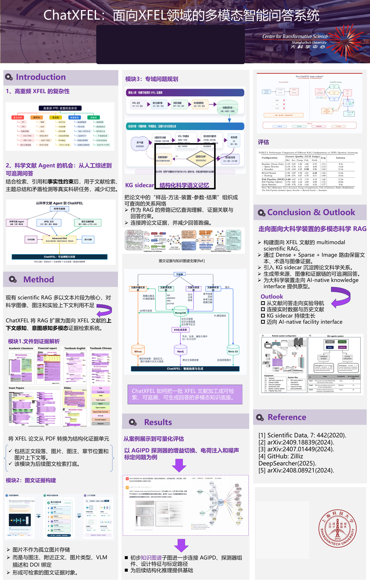

# Academic Poster Portfolio

Research communication artifacts focused on **AI for Science, multimodal RAG, and scientific data systems**.

## ChatXFEL: Multimodal Evidence-Grounded QA for SHINE/XFEL

> **ChatXFEL：面向 SHINE/XFEL 的多模态文献证据增强问答系统**

**🥉 Third Prize · Academic Poster / 学术海报三等奖**<br>
The 6th Workshop on Scientific Data and Software for Advanced Light & Neutron Sources<br>
第六届先进光源中子源科学数据与软件研讨会

| | |
| --- | --- |
| **Date** | 22–26 June 2026 |
| **Venue** | High Energy Photon Source (HEPS), Huairou, Beijing |
| **Links** | [View the anonymized poster (PDF)](posters/2026-chatxfel/chatxfel-poster.pdf) · [Conference website](https://indico.ihep.ac.cn/event/29344/) |

<p align="center">
  <a href="posters/2026-chatxfel/chatxfel-poster.pdf">
    
  </a>
</p>

## Project overview / 项目简介

XFEL knowledge is distributed across paper text, figures, captions, detector descriptions, diagnostic methods, data-processing software, and operational experience. A scientific assistant therefore needs to do more than produce a fluent response: it should return the original evidence behind each claim.

ChatXFEL is an **evidence-first multimodal scientific RAG prototype** for SHINE/XFEL literature. It turns PDFs into structured, searchable evidence and generates answers supported by text, figures, captions, document metadata, and explicit citations.

ChatXFEL 面向 SHINE/XFEL 文献检索、问答与证据追溯，将论文正文、图片、图注和上下文加工为结构化证据单元。系统的目标不是“生成一个看起来正确的回答”，而是让用户能够沿着 DOI、论文标题、页码、图片和图注回到原始证据。

## What the poster demonstrates / 技术亮点

| Capability | Design in ChatXFEL | Why it matters |
| --- | --- | --- |
| Multimodal document intelligence | Parses paragraphs, figures, captions, section positions, nearby context, and metadata from scientific PDFs | Preserves scientific meaning that is lost when figures are treated as isolated images |
| Hybrid evidence retrieval | Combines dense, sparse, and image retrieval with routing and reranking | Covers semantic similarity, domain terminology, and visual evidence |
| KG sidecar | Organizes sample–method–instrument–parameter–result relations as a queryable graph | Connects evidence across papers and constrains answers to domain-relevant facts |
| Traceable generation | Returns answers with source documents and supporting text/figures | Makes scientific QA inspectable instead of merely plausible |
| Domain evaluation | Uses AGIPD detector gain switching, charge injection, and noise calibration as a case study | Tests the system on a concrete XFEL question chain rather than a generic QA demo |

## Conference background / 会议背景

The workshop was hosted by the **National High Energy Physics Science Data Center** at HEPS. It brought together researchers and engineers working on facility operation, IT infrastructure, control and data acquisition, scientific data management and processing, public services, and AI for Science. Advanced light and neutron sources generate massive, multimodal, high-dimensional, and often non-repeatable experimental data, so the quality of their software and data infrastructure directly affects scientific output.

The official program is available through the [IHEP Indico agenda](https://indico.ihep.ac.cn/event/29344/timetable/?view=standard_numbered), and the topic scope is documented in the [call for papers](https://indico.ihep.ac.cn/event/29344/page/2500).

## What I learned / 学习心得

1. **Data infrastructure comes before model capability / 模型之前是数据底座。** 这次会议让我更明确地看到，大科学装置中的 AI 不是一个孤立模型问题。可靠的数据采集、元数据标准、存储、处理框架和质量控制，决定了后续检索、训练与推理的上限。IHEP 团队关于 [HEPS 科学数据处理框架 DAISY](https://indico.ihep.ac.cn/event/29344/contributions/222915/) 的分享也让我看到，通用框架需要同时面对吞吐、异构访问、弹性计算与多方法学融合。

2. **Move from offline analysis to closed-loop experiments / 从离线分析走向在线反馈与闭环调控。** IHEP/HEPS 在[“从实时处理到实时调控”](https://indico.ihep.ac.cn/event/29344/contributions/222862/)中的实践不只追求“把数据算出来”，而是让在线处理结果尽快反馈给实验控制。对 ChatXFEL 而言，这意味着未来需要把历史文献证据与实时实验数据、运行日志和控制决策连接起来。

3. **Build data, knowledge, and tools together / 数据—知识—工具需要协同建设。** [面向 HEPS 的高质量数据集与领域知识库实践](https://indico.ihep.ac.cn/event/29344/contributions/222894/)给我的核心启发是：高质量数据集、领域知识库、知识图谱与分析工具不是四个互不相关的模块。只有统一元数据、证据来源和接口，知识才能持续积累，并真正服务实验问答、流程推荐和科学推理。

4. **Scientific AI must be auditable / 科学智能必须可核验。** 在科研场景里，回答是否流畅远不如证据是否正确重要。ChatXFEL 的 evidence-first 原则——保留 DOI、页码、图像、图注和来源——是我认为最值得继续深化的方向。

5. **The next step is an AI-native facility interface / 下一步是面向装置的 AI-native interface。** 我希望把系统从文献问答扩展为连接论文、手册、实验日志、历史数据和实时数据的知识接口，并通过持续增长的 KG sidecar 支持实验导航和可追溯决策。

## Repository structure

```text
.
├── README.md
├── assets/
│   └── chatxfel-poster-preview.jpg
└── posters/
    └── 2026-chatxfel/
        └── chatxfel-poster.pdf
```

This repository contains a high-resolution, flattened public copy. Author names, affiliation text, contact details, and the QR code have been irreversibly removed; the JPEG is provided only for fast rendering on GitHub.

## Rights

The poster is shared for portfolio and academic communication purposes. Reuse or redistribution is not permitted without authorization.
